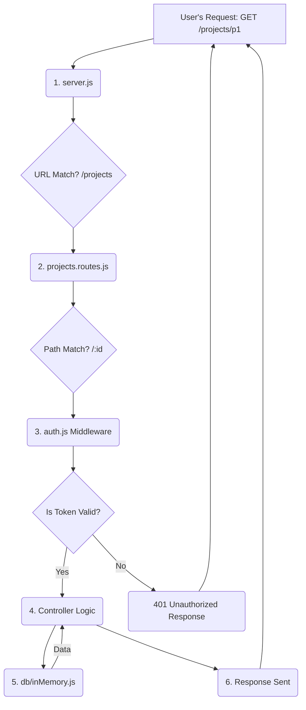

# Understanding the Execution Flow

In a Node.js/Express application, there are two distinct execution flows: **Application Startup** (happens once) and the **Request-Response Cycle** (happens for every API call).

---

## 1. Application Startup Flow

This is the order of events when you first run `npm run dev`.

1.  **`src/server.js` (The Entry Point)**
    *   This is the *only* file that is executed directly by Node.js.
    *   It immediately runs `require("dotenv").config()` to load secrets.

2.  **Dependency Loading (The `require` chain)**
    *   `server.js` starts importing its dependencies. It sees `require("./routes/projects.routes")`.
    *   Node.js pauses execution of `server.js` and jumps into `src/routes/projects.routes.js`.
    *   `projects.routes.js` in turn requires *its* dependencies, like `require("../middleware/auth")` and `require("../db/inMemory")`.
    *   This process continues recursively, building a "dependency tree" in memory. All your modules (`.js` files) are loaded and cached.

3.  **Middleware & Route Mounting (`server.js`)**
    *   Execution returns to `server.js`.
    *   It calls `app.use(cors())` and `app.use(express.json())`. This sets up global middleware that will run on *every* request.
    *   It then calls `app.use("/projects", projectsRoutes)`, `app.use("/users", usersRoutes)`, etc. This creates the main routing table, telling Express which router file is responsible for which URL prefix.

4.  **Listening for Requests (`server.js`)**
    *   Finally, `app.listen(...)` is called. The server is now live, and the startup phase is complete. It does nothing else until an API request comes in.

**In Short: `server.js` starts, loads all other files into memory, sets up the rules, and then waits.**

---

## 2. Request-Response Cycle Flow (The Journey of an API Call)

This is the most important flow to understand. This is the chronological order of what happens when a user tries to **view a specific project**.

**Example Request:** `GET /projects/p1`

---

### Step 1: `src/server.js` (The Front Door)
*   The request first hits `server.js`.
*   **Global Middleware (runs on EVERY request):**
    *   `cors()` runs.
    *   `express.json()` runs (though it does nothing for a `GET` request as there's no body).
*   **Routing Decision:**
    *   Express looks at the URL: `/projects/p1`.
    *   It checks its routing table and finds a match: `app.use("/projects", projectsRoutes)`.
    *   **The request is now handed off to `projects.routes.js`.**

### Step 2: `src/routes/projects.routes.js` (The Department Head)
*   This router now looks at the *rest* of the URL that hasn't been matched yet: `/p1`.
*   It scans its own list of routes top-to-bottom.
    *   Does it match `router.get("/")`? No.
    *   Does it match `router.get("/mine")`? No.
    *   Does it match `router.get("/:id")`? **Yes!**
*   It now knows which handler to use, but first, it must execute the middleware attached to that route.

### Step 3: `src/middleware/auth.js` (The Security Guard)
*   The first middleware listed on the route is `requireAuth`.
*   `requireAuth` function runs.
*   It checks `req.headers.authorization` for a `Bearer` token.
*   It verifies the token with `jwt.verify()`.
*   If the token is valid, it attaches the user's data to the request object (`req.user = ...`).
*   It calls **`next()`**, which tells Express: "This check passed, proceed to the next step in the chain."

### Step 4: The Controller Logic (The Worker)
*   There are no more middleware functions listed on the route, so the final function—the controller—is executed. In this case, it's the inline arrow function:
    ```javascript
    (req, res) => {
        // ...
    }
    ```
*   This function's logic now runs.

### Step 5: `src/db/inMemory.js` (The Filing Cabinet)
*   The controller logic needs data, so it executes:
    ```javascript
    const project = projects.find((p) => p.id === req.params.id);
    ```
*   This code accesses the `projects` array that was imported from `inMemory.js` to find the relevant data.

### Step 6: The Response (The Result)
*   The controller, having found the data, sends it back to the user:
    ```javascript
    return res.json(project);
    ```
*   This `res.json()` call sends the HTTP response.
*   **The cycle is now complete for this request.** The server goes back to waiting for the next one.

---

## Visual Summary of a Request


