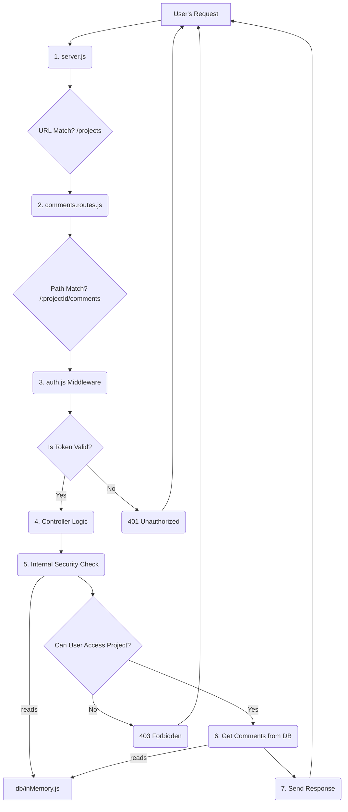

# Understanding the Execution Flow (Updated)

In a Node.js/Express application, there are two distinct execution flows: **Application Startup** (happens once) and the **Request-Response Cycle** (happens for every API call).

---

## 1. Application Startup Flow

This is the order of events when you first run `npm run dev`.

1.  **`src/server.js` (The Entry Point)**
    *   This is the *only* file that is executed directly by Node.js.
    *   It immediately runs `require("dotenv").config()` to load secrets.

2.  **Dependency Loading (The `require` chain)**
    *   `server.js` starts importing its dependencies (`./routes/projects.routes`, `./routes/comments.routes`, etc.).
    *   Node.js pauses execution of `server.js` and jumps into each required file.
    *   Each of those files in turn requires *its* dependencies (e.g., `../middleware/auth`, `../db/inMemory`).
    *   This process continues recursively, building a "dependency tree" in memory. All your modules (`.js` files) are loaded and cached.

3.  **Middleware & Route Mounting (`server.js`)**
    *   Execution returns to `server.js`.
    *   `app.use(cors())` and `app.use(express.json())` are called, setting up global middleware that will run on *every* request.
    *   It then calls `app.use("/projects", ...)`, `app.use("/users", ...)`, etc. This creates the main routing table.
    *   **Note on multiple mounts**: `server.js` mounts `projectsRoutes`, `appointmentsRoutes`, and `commentsRoutes` all to the `/projects` path. This is valid; Express effectively merges them. It will try to find a matching route in each of those files.

4.  **Listening for Requests (`server.js`)**
    *   Finally, `app.listen(...)` is called. The server is now live, and the startup phase is complete. It waits for an API request.

**In Short: `server.js` starts, loads all other files into memory, sets up the rules, and then waits.**

---

## 2. Request-Response Cycle Flow (The Journey of an API Call)

This is the most important flow. Let's trace a more detailed example that shows nested routing.

**Example Request:** `GET /projects/p1/comments`

---

### Step 1: `src/server.js` (The Front Door)
*   The request first hits `server.js`.
*   **Global Middleware:** `cors()` and `express.json()` run.
*   **Routing Decision:**
    *   Express looks at the URL: `/projects/p1/comments`.
    *   It checks its routing table and finds multiple matches for `/projects`. Let's assume it checks `commentsRoutes` first.
    *   **The request is handed off to `src/routes/comments.routes.js`.**

### Step 2: `src/routes/comments.routes.js` (The Department Head)
*   This router looks at the *rest* of the URL that hasn't been matched yet: `/p1/comments`.
*   It scans its own list of routes top-to-bottom.
    *   Does it match `router.get("/:projectId/comments")`? **Yes!**
*   It now knows which handler to use, but first, it must execute the middleware attached to that route.

### Step 3: `src/middleware/auth.js` (The Security Guard)
*   The first middleware listed is `requireAuth`.
*   The `requireAuth` function runs, checks the `Bearer` token, and verifies it.
*   If valid, it attaches user data to `req.user`.
*   It calls **`next()`** to proceed to the main logic.

### Step 4: The Controller Logic (The Worker)
*   There are no more middleware functions on this specific route, so the final inline controller function is executed:
    ```javascript
    (req, res) => {
        // ... logic starts here
    }
    ```

### Step 5: Internal Logic & Database Calls
*   Inside the controller, more functions are called:
    1.  **`ensureProjectExists(projectId)`**: This helper function is called first. It looks in `src/db/inMemory.js` and checks the `projects` array to make sure "p1" exists.
    2.  **`canAccessProject(req, projectId)`**: This security helper runs next. It looks in `src/db/inMemory.js` and checks the `projectMembers` array to see if the current user (`req.user.id`) is a member of project "p1".
    3.  **Data Filtering**: If the security checks pass, the main logic runs. It filters the `comments` array from `src/db/inMemory.js` to find all comments where `projectId` is "p1".

### Step 6: The Response (The Result)
*   The controller, having found the data, sends it back to the user:
    ```javascript
    return res.json(list);
    ```
*   This `res.json()` call sends the HTTP response with the array of comments.
*   **The cycle is now complete.**

---

## Visual Summary of a Nested Request

This diagram shows the more complex flow for `GET /projects/p1/comments`.

